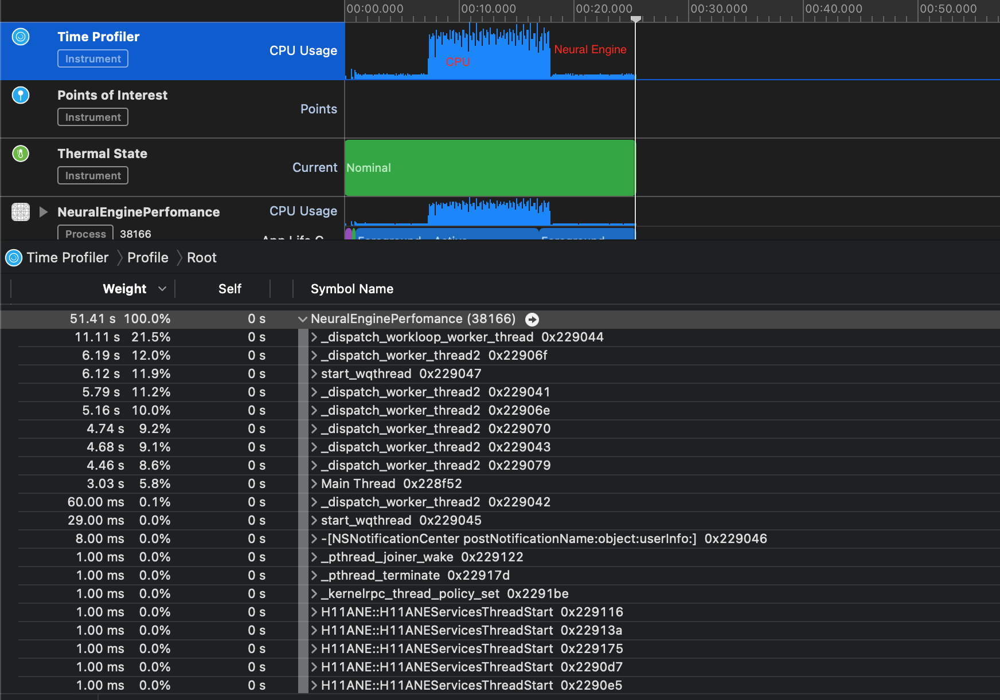
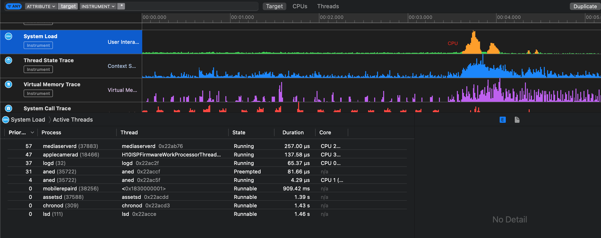

# NeuralEnginePerfomance

Сравнение производительности нейронной сети в устройстве IOS и использованием GPU / CPU / Neural Engine.
Приложение использует Style Transfer model (starry / strong)
Возможные опции:
  - графический процессор GPU
  - центральный процессор CPU
  - NPU Neural Engine
 
Приложение выводит на экран текущее потребление ресурсов 

## Цель
Продемонстрировать разницу во времени получения результата работы модели с использованием блока Neural Engine, и без него.

## Requirements
- iOS 14.2+
- xCode 12.2+

## Device
Любой Iphone c Apple A11 или старше 

## Profiler 

## System Load

## Starry Blue 

Пиковое значение загрузки CPU (чистое выполнение на CPU ) ~ 430%.
Загрузка CPU при выполнение на Neural Engine ~ 43 %

## Strong Blue 

Пиковое значение загрузки CPU (чистое выполнение на CPU ) ~ 450%.  
Загрузка CPU при выполнение на Neural Engine ~ 43 %

## Вывод
Аппаратный блок Neural Engine показывает 9-кратный прирост производительности, по сравнении с CPU
